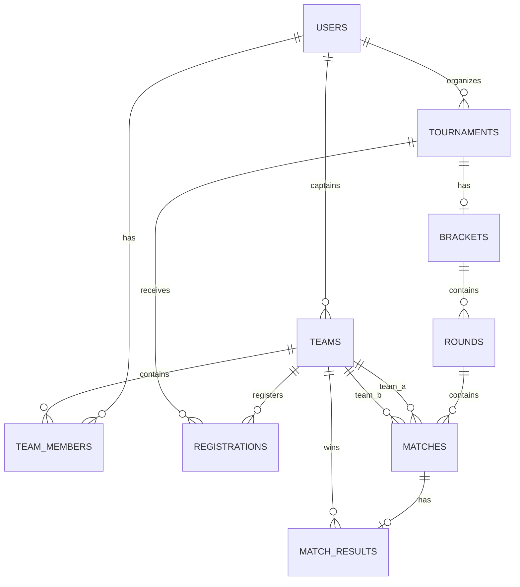
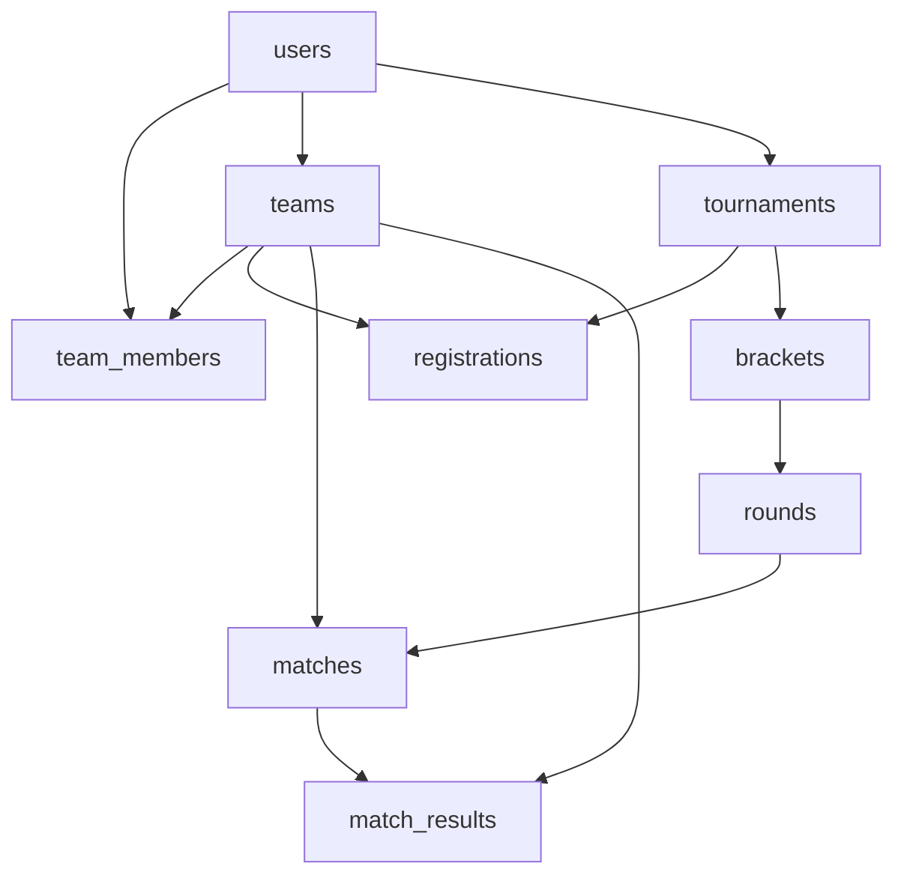

# Database Tables Specification

## 1. Phạm vi

Tài liệu này chuyển 12 model đã chốt thành cấu trúc database.

Thiết kế gồm **9 bảng**:

1. `users`
2. `teams`
3. `team_members`
4. `tournaments`
5. `registrations`
6. `brackets`
7. `rounds`
8. `matches`
9. `match_results`

Ba model `Player`, `Organizer`, `Admin` kế thừa `User` và không có field riêng, vì vậy không tạo bảng riêng cho ba model này.

> Lưu ý: `bracket_id` trong bảng `rounds` là khóa ngoại phục vụ việc lưu quan hệ `Bracket -> Round`. Đây là thông tin quan hệ ở tầng database, không phải field hiện tại của model `Round`.

---

# 2. Bảng `users`

## Công dụng

Lưu thông tin chung của tất cả người dùng trong hệ thống.

Các model `User`, `Player`, `Organizer` và `Admin` được ánh xạ vào cùng bảng này. Cột `role` dùng để xác định loại người dùng.

## Cấu trúc

| Column | Type | Constraints | Ý nghĩa |
|---|---|---|---|
| `user_id` | `BIGINT` | PK, NOT NULL | ID duy nhất của người dùng |
| `username` | `VARCHAR(100)` | NOT NULL, UNIQUE | Tên đăng nhập |
| `password` | `VARCHAR(255)` | NOT NULL | Mật khẩu đã được hash |
| `email` | `VARCHAR(255)` | NOT NULL, UNIQUE | Email |
| `full_name` | `VARCHAR(255)` | NOT NULL | Họ và tên |
| `role` | `VARCHAR(30)` | NOT NULL | Vai trò của người dùng |

## Giá trị `role`

```text
PLAYER
ORGANIZER
ADMIN
```

## Primary Key

```text
user_id
```

## Unique

```text
username
email
```

---

# 3. Bảng `teams`

## Công dụng

Lưu thông tin đội thi đấu.

## Cấu trúc

| Column | Type | Constraints | Ý nghĩa |
|---|---|---|---|
| `team_id` | `BIGINT` | PK, NOT NULL | ID đội |
| `team_name` | `VARCHAR(150)` | NOT NULL | Tên đội |
| `description` | `TEXT` | NULL | Mô tả đội |
| `captain_id` | `BIGINT` | FK, NOT NULL | ID người chơi làm đội trưởng |
| `status` | `VARCHAR(30)` | NOT NULL | Trạng thái đội |

## Primary Key

```text
team_id
```

## Foreign Key

```text
captain_id -> users.user_id
```

## Giá trị `status`

```text
ACTIVE
INACTIVE
```

## Ghi chú

`captain_id` tham chiếu đến `users.user_id`. Ở tầng nghiệp vụ, user được tham chiếu phải có role `PLAYER`.

---

# 4. Bảng `team_members`

## Công dụng

Lưu thành viên của từng đội. Đây là bảng trung gian tương ứng với model `TeamMember`.

## Cấu trúc

| Column | Type | Constraints | Ý nghĩa |
|---|---|---|---|
| `team_id` | `BIGINT` | PK, FK, NOT NULL | ID đội |
| `player_id` | `BIGINT` | PK, FK, NOT NULL | ID người chơi |
| `joined_at` | `TIMESTAMP` | NOT NULL | Thời điểm người chơi tham gia đội |
| `role` | `VARCHAR(30)` | NOT NULL | Vai trò trong đội |

## Primary Key

Dùng khóa chính kép:

```text
(team_id, player_id)
```

Điều này ngăn một player xuất hiện nhiều lần trong cùng một team.

## Foreign Keys

```text
team_id -> teams.team_id
player_id -> users.user_id
```

## Giá trị `role`

```text
CAPTAIN
MEMBER
```

## Ghi chú

`player_id` phải tham chiếu đến user có role `PLAYER`.

`teams.captain_id` và `team_members.role = CAPTAIN` phải được giữ nhất quán ở tầng service.

---

# 5. Bảng `tournaments`

## Công dụng

Lưu thông tin của giải đấu, người tổ chức, thời gian, số đội tối đa, thể thức và trạng thái.

## Cấu trúc

| Column | Type | Constraints | Ý nghĩa |
|---|---|---|---|
| `tournament_id` | `BIGINT` | PK, NOT NULL | ID giải đấu |
| `name` | `VARCHAR(200)` | NOT NULL | Tên giải |
| `game` | `VARCHAR(150)` | NOT NULL | Tên game |
| `organizer_id` | `BIGINT` | FK, NOT NULL | Người tổ chức |
| `start_date` | `TIMESTAMP` | NOT NULL | Thời gian bắt đầu |
| `end_date` | `TIMESTAMP` | NOT NULL | Thời gian kết thúc |
| `max_teams` | `INT` | NOT NULL | Số đội tối đa |
| `format` | `VARCHAR(50)` | NOT NULL | Thể thức |
| `status` | `VARCHAR(50)` | NOT NULL | Trạng thái giải |

## Primary Key

```text
tournament_id
```

## Foreign Key

```text
organizer_id -> users.user_id
```

## Giá trị `format`

```text
SINGLE_ELIMINATION
DOUBLE_ELIMINATION
ROUND_ROBIN
```

## Giá trị `status`

```text
OPEN_REGISTRATION
REGISTRATION_CLOSED
ONGOING
COMPLETED
CANCELLED
```

## Ràng buộc nghiệp vụ nên có

```text
max_teams > 0
end_date >= start_date
organizer_id phải là user có role ORGANIZER
```

---

# 6. Bảng `registrations`

## Công dụng

Lưu việc một đội đăng ký tham gia một giải đấu.

Đây là bảng trung gian cho quan hệ nhiều-nhiều giữa `Team` và `Tournament`.

## Cấu trúc

| Column | Type | Constraints | Ý nghĩa |
|---|---|---|---|
| `registration_id` | `BIGINT` | PK, NOT NULL | ID đăng ký |
| `team_id` | `BIGINT` | FK, NOT NULL | Đội đăng ký |
| `tournament_id` | `BIGINT` | FK, NOT NULL | Giải đấu |
| `registration_date` | `TIMESTAMP` | NOT NULL | Thời điểm đăng ký |
| `status` | `VARCHAR(30)` | NOT NULL | Trạng thái đăng ký |
| `check_in_status` | `VARCHAR(30)` | NOT NULL | Trạng thái check-in |

## Primary Key

```text
registration_id
```

## Foreign Keys

```text
team_id -> teams.team_id
tournament_id -> tournaments.tournament_id
```

## Unique

```text
UNIQUE(team_id, tournament_id)
```

Mục đích: một đội không thể đăng ký cùng một giải đấu nhiều lần.

## Giá trị `status`

```text
PENDING
APPROVED
REJECTED
CANCELLED
```

## Giá trị `check_in_status`

```text
NOT_CHECKED_IN
CHECKED_IN
```

---

# 7. Bảng `brackets`

## Công dụng

Lưu bảng đấu của một giải đấu và thể thức được sử dụng.

## Cấu trúc

| Column | Type | Constraints | Ý nghĩa |
|---|---|---|---|
| `bracket_id` | `BIGINT` | PK, NOT NULL | ID bảng đấu |
| `tournament_id` | `BIGINT` | FK, NOT NULL, UNIQUE | Giải đấu |
| `format` | `VARCHAR(50)` | NOT NULL | Thể thức của bảng đấu |

## Primary Key

```text
bracket_id
```

## Foreign Key

```text
tournament_id -> tournaments.tournament_id
```

## Unique

```text
tournament_id
```

`UNIQUE(tournament_id)` biểu diễn rằng mỗi tournament chỉ có một bracket chính trong scope hiện tại.

---

# 8. Bảng `rounds`

## Công dụng

Lưu các vòng đấu thuộc một bracket.

## Cấu trúc

| Column | Type | Constraints | Ý nghĩa |
|---|---|---|---|
| `round_id` | `BIGINT` | PK, NOT NULL | ID vòng đấu |
| `bracket_id` | `BIGINT` | FK, NOT NULL | Bracket chứa vòng |
| `round_number` | `INT` | NOT NULL | Số thứ tự vòng |
| `name` | `VARCHAR(100)` | NOT NULL | Tên vòng |

## Primary Key

```text
round_id
```

## Foreign Key

```text
bracket_id -> brackets.bracket_id
```

## Unique

```text
UNIQUE(bracket_id, round_number)
```

Điều này đảm bảo trong cùng một bracket không có hai round cùng số thứ tự.

---

# 9. Bảng `matches`

## Công dụng

Lưu thông tin trận đấu, hai đội tham gia, thời gian thi đấu, vòng đấu và trạng thái trận.

## Cấu trúc

| Column | Type | Constraints | Ý nghĩa |
|---|---|---|---|
| `match_id` | `BIGINT` | PK, NOT NULL | ID trận |
| `team_a_id` | `BIGINT` | FK, NULL | Đội ở vị trí A |
| `team_b_id` | `BIGINT` | FK, NULL | Đội ở vị trí B |
| `scheduled_time` | `TIMESTAMP` | NULL | Thời gian thi đấu |
| `round_id` | `BIGINT` | FK, NOT NULL | Vòng chứa trận |
| `status` | `VARCHAR(30)` | NOT NULL | Trạng thái trận |

## Primary Key

```text
match_id
```

## Foreign Keys

```text
team_a_id -> teams.team_id
team_b_id -> teams.team_id
round_id -> rounds.round_id
```

## Giá trị `status`

```text
SCHEDULED
ONGOING
COMPLETED
CANCELLED
```

## Ghi chú

`team_a_id` và `team_b_id` được phép `NULL` vì khi bracket vừa được tạo, đội thi đấu có thể chưa được xác định.

Không tạo bảng `match_teams` vì model hiện tại đã cố định hai vị trí:

```text
teamA
teamB
```

## Ràng buộc nghiệp vụ nên có

```text
team_a_id <> team_b_id
```

Nếu cả hai đội đã được xác định thì không được là cùng một đội.

---

# 10. Bảng `match_results`

## Công dụng

Lưu kết quả của một trận đấu.

## Cấu trúc

| Column | Type | Constraints | Ý nghĩa |
|---|---|---|---|
| `match_id` | `BIGINT` | PK, FK, NOT NULL | ID trận |
| `score_a` | `INT` | NOT NULL | Điểm đội A |
| `score_b` | `INT` | NOT NULL | Điểm đội B |
| `winner_id` | `BIGINT` | FK, NULL | Đội chiến thắng |

## Primary Key

```text
match_id
```

## Foreign Keys

```text
match_id -> matches.match_id
winner_id -> teams.team_id
```

`match_id` vừa là PK vừa là FK nên một match chỉ có tối đa một result.

## Ràng buộc nghiệp vụ nên có

```text
score_a >= 0
score_b >= 0
```

`winner_id` phải là một trong:

```text
matches.team_a_id
matches.team_b_id
```

trừ trường hợp nghiệp vụ cho phép hòa.

---

# 11. Tổng hợp Primary Key

| Table | Primary Key |
|---|---|
| `users` | `user_id` |
| `teams` | `team_id` |
| `team_members` | `(team_id, player_id)` |
| `tournaments` | `tournament_id` |
| `registrations` | `registration_id` |
| `brackets` | `bracket_id` |
| `rounds` | `round_id` |
| `matches` | `match_id` |
| `match_results` | `match_id` |

---

# 12. Tổng hợp Foreign Key

| Table | Column | References |
|---|---|---|
| `teams` | `captain_id` | `users.user_id` |
| `team_members` | `team_id` | `teams.team_id` |
| `team_members` | `player_id` | `users.user_id` |
| `tournaments` | `organizer_id` | `users.user_id` |
| `registrations` | `team_id` | `teams.team_id` |
| `registrations` | `tournament_id` | `tournaments.tournament_id` |
| `brackets` | `tournament_id` | `tournaments.tournament_id` |
| `rounds` | `bracket_id` | `brackets.bracket_id` |
| `matches` | `team_a_id` | `teams.team_id` |
| `matches` | `team_b_id` | `teams.team_id` |
| `matches` | `round_id` | `rounds.round_id` |
| `match_results` | `match_id` | `matches.match_id` |
| `match_results` | `winner_id` | `teams.team_id` |

---

# 13. Quan hệ giữa các bảng



---

# 14. Cardinality

| Quan hệ | Cardinality |
|---|---|
| `users` → `teams` qua `captain_id` | 1:N |
| `users` → `team_members` | 1:N |
| `teams` → `team_members` | 1:N |
| `users` → `tournaments` qua `organizer_id` | 1:N |
| `teams` → `registrations` | 1:N |
| `tournaments` → `registrations` | 1:N |
| `tournaments` → `brackets` | 1:0..1 |
| `brackets` → `rounds` | 1:N |
| `rounds` → `matches` | 1:N |
| `teams` → `matches` qua `team_a_id` | 1:N |
| `teams` → `matches` qua `team_b_id` | 1:N |
| `matches` → `match_results` | 1:0..1 |
| `teams` → `match_results` qua `winner_id` | 1:N |

---

# 15. Mapping Model → Table

| Model | Table |
|---|---|
| `User` | `users` |
| `Player` | `users` |
| `Organizer` | `users` |
| `Admin` | `users` |
| `Team` | `teams` |
| `TeamMember` | `team_members` |
| `Tournament` | `tournaments` |
| `Registration` | `registrations` |
| `Bracket` | `brackets` |
| `Round` | `rounds` |
| `Match` | `matches` |
| `MatchResult` | `match_results` |

---

# 16. Các enum cần lưu trong database

Các enum hiện tại có thể lưu dưới dạng `VARCHAR` để database dễ đọc và ít phụ thuộc hệ quản trị.

| Enum | Giá trị |
|---|---|
| `UserRole` | `PLAYER`, `ORGANIZER`, `ADMIN` |
| `TeamStatus` | `ACTIVE`, `INACTIVE` |
| `TeamMemberRole` | `CAPTAIN`, `MEMBER` |
| `TournamentFormat` | `SINGLE_ELIMINATION`, `DOUBLE_ELIMINATION`, `ROUND_ROBIN` |
| `TournamentStatus` | `OPEN_REGISTRATION`, `REGISTRATION_CLOSED`, `ONGOING`, `COMPLETED`, `CANCELLED` |
| `RegistrationStatus` | `PENDING`, `APPROVED`, `REJECTED`, `CANCELLED` |
| `CheckInStatus` | `NOT_CHECKED_IN`, `CHECKED_IN` |
| `MatchStatus` | `SCHEDULED`, `ONGOING`, `COMPLETED`, `CANCELLED` |

---

# 17. Các ràng buộc nghiệp vụ quan trọng

## User

- `username` không được trùng.
- `email` không được trùng.
- `role` phải thuộc `PLAYER`, `ORGANIZER`, `ADMIN`.

## Team

- `captain_id` phải tham chiếu đến một `PLAYER`.
- Tên đội không nên để NULL.
- Team không nên bị xóa nếu đang được sử dụng trong tournament hoặc match.

## TeamMember

- Một player không được xuất hiện hai lần trong cùng team.
- `role = CAPTAIN` phải nhất quán với `teams.captain_id`.
- Một player có thể tham gia nhiều team nếu nghiệp vụ cho phép.

## Tournament

- `organizer_id` phải là `ORGANIZER`.
- `max_teams > 0`.
- `end_date >= start_date`.
- Chỉ các team có registration hợp lệ mới được tham gia bracket.

## Registration

- Một team chỉ được đăng ký một lần trong một tournament.
- Không được vượt quá `max_teams` ở trạng thái registration hợp lệ.
- Check-in chỉ nên được thực hiện khi registration được chấp nhận.

## Bracket

- Một tournament chỉ có một bracket chính trong scope hiện tại.
- Bracket chỉ nên được tạo khi tournament đủ điều kiện bắt đầu.

## Round

- `round_number` phải duy nhất trong cùng một bracket.
- Mỗi round thuộc đúng một bracket.

## Match

- Một match thuộc đúng một round.
- `team_a_id` và `team_b_id` không được trùng nhau khi cả hai đã có giá trị.
- Match có thể chưa có một hoặc cả hai team trước khi bracket được hoàn thiện.

## MatchResult

- Một match tối đa có một result.
- Điểm số không được âm.
- `winner_id` phải là một trong hai team của match nếu trận có người thắng.
- Result chỉ nên được tạo/cập nhật khi match ở trạng thái phù hợp.

---

# 18. Thứ tự tạo bảng

Để tránh lỗi Foreign Key khi khởi tạo database, có thể tạo bảng theo thứ tự:

```text
1. users
2. teams
3. team_members
4. tournaments
5. registrations
6. brackets
7. rounds
8. matches
9. match_results
```

Thứ tự này đi từ bảng gốc đến bảng phụ thuộc.

---

# 19. Thứ tự xóa dữ liệu

Khi cần xóa toàn bộ dữ liệu, nên xử lý theo thứ tự ngược lại:

```text
1. match_results
2. matches
3. rounds
4. brackets
5. registrations
6. tournaments
7. team_members
8. teams
9. users
```

Điều này giúp tránh lỗi do Foreign Key đang tham chiếu đến bản ghi cha.

---

# 20. Tổng quan kiến trúc database



---

# 21. Kết luận

Database hiện tại có **9 bảng** và ánh xạ được toàn bộ 12 model đã chốt.

Ba model:

```text
Player
Organizer
Admin
```

không tạo bảng riêng vì đều kế thừa `User` và không có field riêng.

Các bảng trung gian:

```text
team_members
registrations
```

được sử dụng để biểu diễn các quan hệ nhiều-nhiều.

Cấu trúc thi đấu được tách thành:

```text
Tournament
    ↓
Bracket
    ↓
Round
    ↓
Match
    ↓
MatchResult
```

Ba module chưa được triển khai:

```text
Ranking Management
Statistics Management
Notification Management
```

không tạo bảng ở giai đoạn hiện tại.
