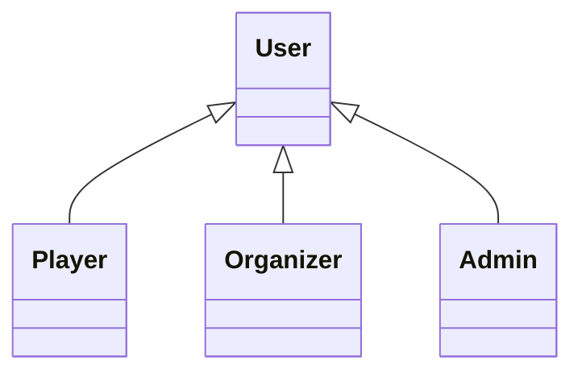

# Model Fields Specification

## 1. User

### Công dụng
`User` là model cha dùng để lưu thông tin chung của người dùng trong hệ thống. `Player`, `Organizer` và `Admin` kế thừa từ `User`.

### Fields

| Field | Type | Ý nghĩa |
|---|---|---|
| `userId` | `long` | Mã định danh duy nhất của người dùng. |
| `username` | `String` | Tên đăng nhập của người dùng. |
| `password` | `String` | Mật khẩu của người dùng. |
| `email` | `String` | Địa chỉ email của người dùng. |
| `fullName` | `String` | Họ và tên của người dùng. |
| `role` | `UserRole` | Vai trò của người dùng trong hệ thống: `PLAYER`, `ORGANIZER` hoặc `ADMIN`. |

## 2. Player

### Vai trò
`Player` đại diện cho người chơi trong hệ thống. Model này kế thừa từ `User` và không bổ sung field riêng.

### Kế thừa
`Player` kế thừa toàn bộ fields của `User`.

## 3. Organizer

### Vai trò
`Organizer` đại diện cho người tổ chức giải đấu trong hệ thống. Model này kế thừa từ `User` và không bổ sung field riêng.

### Kế thừa
`Organizer` kế thừa toàn bộ fields của `User`.

## 4. Admin

### Vai trò
`Admin` đại diện cho quản trị viên của hệ thống. Model này kế thừa từ `User` và không bổ sung field riêng. Quyền được xác định thông qua `UserRole`.

### Kế thừa
`Admin` kế thừa toàn bộ fields của `User`.

## 5. Team

### Công dụng
`Team` đại diện cho một đội tham gia các giải đấu. Model lưu thông tin đội, đội trưởng, danh sách thành viên và trạng thái của đội.

### Fields

| Field | Type | Ý nghĩa |
|---|---|---|
| `teamId` | `long` | Mã định danh duy nhất của đội. |
| `teamName` | `String` | Tên của đội. |
| `description` | `String` | Mô tả về đội. |
| `captain` | `Player` | Người chơi giữ vai trò đội trưởng của đội. |
| `members` | `List<TeamMember>` | Danh sách thành viên của đội thông qua model `TeamMember`. |
| `status` | `TeamStatus` | Trạng thái hoạt động của đội: `ACTIVE` hoặc `INACTIVE`. |

## 6. TeamMember

### Công dụng
`TeamMember` là model trung gian thể hiện mối quan hệ giữa `Player` và `Team`, đồng thời lưu thông tin về thời điểm tham gia và vai trò của người chơi trong đội.

### Fields

| Field | Type | Ý nghĩa |
|---|---|---|
| `player` | `Player` | Người chơi tham gia đội. |
| `joinedAt` | `LocalDateTime` | Thời điểm người chơi tham gia đội. |
| `role` | `TeamMemberRole` | Vai trò của người chơi trong đội: `CAPTAIN` hoặc `MEMBER`. |

## 7. Tournament

### Công dụng
`Tournament` đại diện cho một giải đấu trong hệ thống, bao gồm thông tin giải đấu, người tổ chức, thời gian, số lượng đội tối đa, thể thức và trạng thái.

### Fields

| Field | Type | Ý nghĩa |
|---|---|---|
| `tournamentId` | `long` | Mã định danh duy nhất của giải đấu. |
| `name` | `String` | Tên giải đấu. |
| `game` | `String` | Tên trò chơi được tổ chức trong giải đấu. |
| `organizer` | `Organizer` | Người tổ chức giải đấu. |
| `startDate` | `LocalDateTime` | Thời gian bắt đầu giải đấu. |
| `endDate` | `LocalDateTime` | Thời gian kết thúc giải đấu. |
| `maxTeams` | `int` | Số lượng đội tối đa được phép tham gia. |
| `format` | `TournamentFormat` | Thể thức thi đấu của giải đấu. |
| `status` | `TournamentStatus` | Trạng thái hiện tại của giải đấu. |

## 8. Registration

### Công dụng
`Registration` là model trung gian thể hiện việc một `Team` đăng ký tham gia một `Tournament`, đồng thời lưu trạng thái đăng ký và check-in.

### Fields

| Field | Type | Ý nghĩa |
|---|---|---|
| `registrationId` | `long` | Mã định danh duy nhất của đăng ký. |
| `team` | `Team` | Đội thực hiện đăng ký. |
| `tournament` | `Tournament` | Giải đấu mà đội đăng ký tham gia. |
| `registrationDate` | `LocalDateTime` | Thời điểm đội thực hiện đăng ký. |
| `status` | `RegistrationStatus` | Trạng thái đăng ký: `PENDING`, `APPROVED`, `REJECTED` hoặc `CANCELLED`. |
| `checkInStatus` | `CheckInStatus` | Trạng thái check-in: `NOT_CHECKED_IN` hoặc `CHECKED_IN`. |

## 9. Bracket

### Công dụng
`Bracket` đại diện cho bảng đấu của một giải đấu, xác định thể thức và chứa các vòng đấu (`Round`) tương ứng.

### Fields

| Field | Type | Ý nghĩa |
|---|---|---|
| `bracketId` | `long` | Mã định danh duy nhất của bảng đấu. |
| `tournament` | `Tournament` | Giải đấu mà bảng đấu thuộc về. |
| `format` | `TournamentFormat` | Thể thức thi đấu được sử dụng cho bảng đấu. |
| `rounds` | `List<Round>` | Danh sách các vòng đấu trong bảng đấu. |

## 10. Round

### Công dụng
`Round` đại diện cho một vòng đấu trong `Bracket`, xác định số thứ tự, tên vòng và danh sách các trận đấu thuộc vòng đó.

### Fields

| Field | Type | Ý nghĩa |
|---|---|---|
| `roundNumber` | `int` | Số thứ tự của vòng đấu. |
| `name` | `String` | Tên của vòng đấu. |
| `matches` | `List<Match>` | Danh sách các trận đấu thuộc vòng. |

## 11. Match

### Công dụng
`Match` đại diện cho một trận đấu giữa hai đội trong một vòng đấu, đồng thời lưu lịch thi đấu, trạng thái và kết quả của trận.

### Fields

| Field | Type | Ý nghĩa |
|---|---|---|
| `matchId` | `long` | Mã định danh duy nhất của trận đấu. |
| `teamA` | `Team` | Đội ở vị trí A của trận đấu. Có thể chưa có giá trị trước khi bracket xác định đội. |
| `teamB` | `Team` | Đội ở vị trí B của trận đấu. Có thể chưa có giá trị trước khi bracket xác định đội. |
| `scheduledTime` | `LocalDateTime` | Thời gian dự kiến diễn ra trận đấu. |
| `round` | `Round` | Vòng đấu mà trận đấu thuộc về. |
| `status` | `MatchStatus` | Trạng thái trận đấu: `SCHEDULED`, `ONGOING`, `COMPLETED` hoặc `CANCELLED`. |
| `result` | `MatchResult` | Kết quả của trận đấu; có thể chưa có khi trận chưa hoàn thành. |

## 12. MatchResult

### Công dụng
`MatchResult` lưu kết quả của một trận đấu, bao gồm điểm số của hai đội và đội chiến thắng.

### Fields

| Field | Type | Ý nghĩa |
|---|---|---|
| `scoreA` | `int` | Điểm của đội A. |
| `scoreB` | `int` | Điểm của đội B. |
| `winner` | `Team` | Đội chiến thắng trong trận đấu. |

## 13. Tổng hợp toàn bộ model

| Model | Fields |
|---|---|
| `User` | `userId`, `username`, `password`, `email`, `fullName`, `role` |
| `Player` | Kế thừa từ `User`, không có field riêng |
| `Organizer` | Kế thừa từ `User`, không có field riêng |
| `Admin` | Kế thừa từ `User`, không có field riêng |
| `Team` | `teamId`, `teamName`, `description`, `captain`, `members`, `status` |
| `TeamMember` | `player`, `joinedAt`, `role` |
| `Tournament` | `tournamentId`, `name`, `game`, `organizer`, `startDate`, `endDate`, `maxTeams`, `format`, `status` |
| `Registration` | `registrationId`, `team`, `tournament`, `registrationDate`, `status`, `checkInStatus` |
| `Bracket` | `bracketId`, `tournament`, `format`, `rounds` |
| `Round` | `roundNumber`, `name`, `matches` |
| `Match` | `matchId`, `teamA`, `teamB`, `scheduledTime`, `round`, `status`, `result` |
| `MatchResult` | `scoreA`, `scoreB`, `winner` |

### Quan hệ kế thừa

### Enum được sử dụng

| Enum | Giá trị |
|---|---|
| `UserRole` | `PLAYER`, `ORGANIZER`, `ADMIN` |
| `TeamStatus` | `ACTIVE`, `INACTIVE` |
| `TeamMemberRole` | `CAPTAIN`, `MEMBER` |
| `TournamentFormat` | `SINGLE_ELIMINATION`, `DOUBLE_ELIMINATION`, `ROUND_ROBIN` |
| `TournamentStatus` | `OPEN_REGISTRATION`, `REGISTRATION_CLOSED`, `ONGOING`, `COMPLETED`, `CANCELLED` |
| `RegistrationStatus` | `PENDING`, `APPROVED`, `REJECTED`, `CANCELLED` |
| `CheckInStatus` | `NOT_CHECKED_IN`, `CHECKED_IN` |
| `MatchStatus` | `SCHEDULED`, `ONGOING`, `COMPLETED`, `CANCELLED` |
